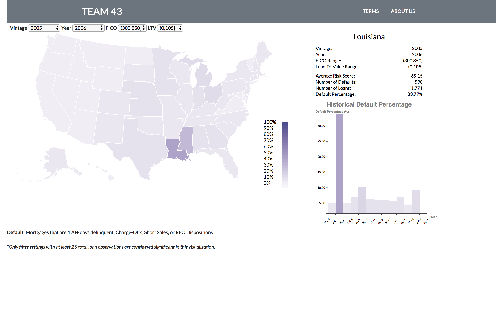

Georgia Tech | CSE 6242 DVA | Fall 2018 | Team 43

***26,300,000 Loans.***
 ***18 Years of Payment Histories.***
 ***75 GB Data.***
 ***0.993 R-Squared.***
 ***2 UIs.***

Our team wanted to create a tool that lets both lenders and borrowers easily gauge both the financial market and mortgage loan characteristics to make better informed decisions. An initial data exploration effort was undertaken using python and the `seaborn` plotting library. Then we brainstormed the details of our project, culminating in the Proposal and Proposal Presentation. At project completion, our team successfully delivered the following artifacts:
* Final Poster
* Final Report
* Two AWS Hosted User Interfaces

This project utilized the following technologies:
* Python (`pandas`, `numpy`, `sklearn`, `seaborn`, `h20`, `Selenium`, `matplotlib`)
* Javascript (D3, React)
* SQLite
* AWS

# Interactive Tool URL (works as of 01/14/2019):

http://ec2-18-234-204-32.compute-1.amazonaws.com/
 
# Landing Page:

# Risk-based Mortgage Quote

Our free risk-based mortgage quote tool provides users with a quote that is capable of predicting average market rates within . The underlying model our team developed has a 0.993 R-Squared value for predicting the interest rate given at loan origination. Model details can be found in the Final Report.

# Geographical Heatmap:

Our interactive choropleth tool allows users to explore loan default history by the following attributes:
* Vintage: Year of loan origination.
* Year: Year of default.
* FICO: A number, prepared by third parties, summarizing the borrower’s creditworthiness, which may be indicative of the likelihood that the borrower will timely repay future obligations.
* LTV: A ratio obtained by dividing the original mortgage loan amount on the note date by the lesser of the mortgaged property’s appraised value on the note date or its purchase price.

For example, look at the fallout from the [2008 Housing Crisis:](https://en.wikipedia.org/wiki/United_States_housing_bubble)

 

At the peak of the crisis, Nevada had an ***88.4% Default Rate*** for low credit, high risk (FICO 300-670) applicants who had loans originating during 2007 (when a majority of the subprime mortgages were originated).

Or the effects of [Hurricane Katrina](https://en.wikipedia.org/wiki/Hurricane_Katrina) on the Luisiana market: 

Where 1 out of every 3 homebuyers the year before had to default.

Or look at the effects of plummeting oil prices [November 2014](https://www.marketwatch.com/story/oil-continues-to-collapse-a-day-after-opec-stands-firm-on-production-2014-11-28) on the Texas housing market: 

See the default rate spike roughly 3x the usual in 2015? That's when the work in West Texas slowed to a crawl.
